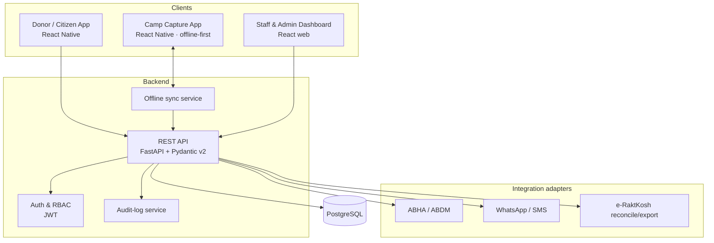
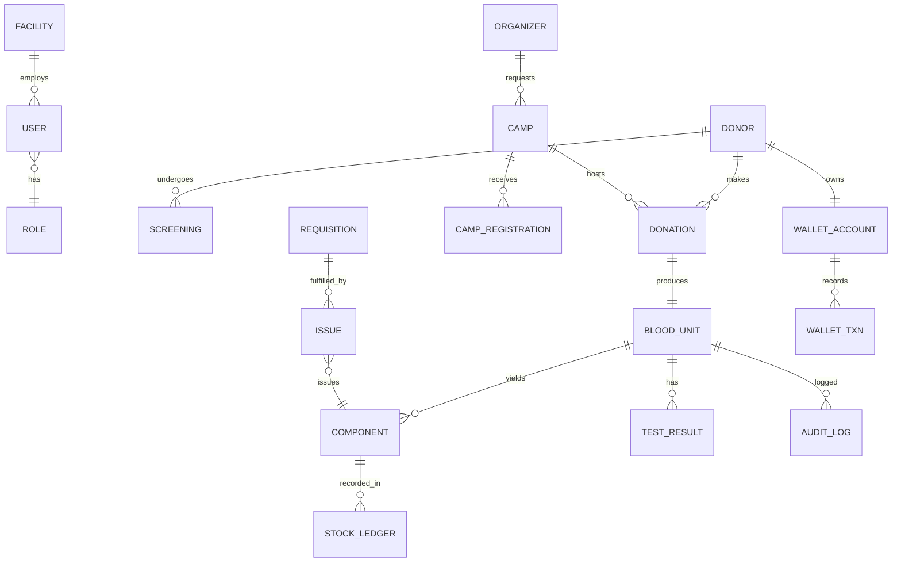

# RAKT Durg — Digital Blood Bank Platform
### Technical Requirements Document (TRD)

| | |
|---|---|
| **Document** | TRD v0.1 (Draft) |
| **Author** | Business Architect (with IIT Bhilai tech team) |
| **References** | RAKT Durg BRD v0.1; RAKT Durg Proposal v0.1 |
| **Status** | Reference architecture — stack and integrations to be confirmed by the IIT Bhilai tech team |

---

## 1. Purpose & Scope

This TRD translates the RAKT Durg BRD into a technical design: architecture, technology stack, data model, APIs, integrations, security/compliance, non-functional requirements, and build phasing. Requirement IDs (`BR-*`) reference the BRD.

## 2. Architecture Overview

Three clients (citizen/donor app, camp-capture app, staff/admin web dashboard) over a single backend API, a relational store, and a set of integration adapters. Camp capture is **offline-first** with sync.

## 3. Technology Stack (proposed, adjustable)

| Layer | Choice | Rationale |
|---|---|---|
| Backend API | **Python 3.12, FastAPI, Pydantic v2** | Typed models, fast to build, team-familiar |
| ORM / migrations | SQLAlchemy 2.x + Alembic | Mature, migration-safe |
| Database | **PostgreSQL** | Relational integrity for units/traceability; JSONB where needed |
| Staff/Admin web | **React** (+ a component lib) | Dashboards, workflows |
| Mobile (donor + camp) | **React Native (Expo)** | Single codebase, barcode + camera, offline (SQLite) |
| Barcode | Code128 / QR (MVP), **ISBT 128–compatible** design | Standards path for blood products |
| Auth | JWT (access/refresh) + RBAC | Simple, stateless |
| Notifications | WhatsApp Business API (via BSP) + SMS gateway | Health-report return, status |
| Containerization | Docker (+ compose for local) | Portable to govt cloud |
| Hosting | Govt cloud (NIC / MeghRaj) or India-region cloud | Data residency |
| CI/CD | GitHub Actions (or GitLab CI) | Automated test/build |

> **Alternatives:** Node/NestJS backend or Flutter mobile are acceptable substitutions if the IIT Bhilai team prefers — the design is stack-agnostic at the interface level.

## 4. System Components

- **API service** — all business logic; exposes REST endpoints per module.
- **Auth & RBAC** — authentication, roles (admin, medical officer, lab tech, phlebotomist, inventory officer, organizer, donor, citizen-read).
- **Audit service** — immutable log of unit state changes and PII access (BR-ADM-03).
- **Offline sync** — queue + conflict resolution for camp capture (BR-DON-08).
- **Integration adapters** — ABHA/ABDM, WhatsApp/SMS, e-RaktKosh, each behind an interface with a mock implementation until real access is confirmed.
- **Dashboard web app** — stock, camps, requisitions, analytics.
- **Mobile apps** — donor (register, health record, wallet view) and camp capture (screening, barcode issuance).

## 5. Data Model (core entities)

Representative fields (not exhaustive):

- **Donor** — id, name, DOB/age, sex, contact, ABHA reference (no raw Aadhaar), blood group, consent flag/timestamp, status.
- **Screening** — id, donor_id, camp_id, vitals, hemoglobin, questionnaire (JSONB), eligibility result, deferral reason, timestamp, captured_offline flag.
- **Donation** — id, donor_id, camp_id, datetime, collected_by.
- **Blood Unit** — id, **barcode**, donation_id, blood_group, collection_datetime, expiry_datetime, release_status, lifecycle_state.
- **Component** — id, unit_id, type (WholeBlood/PRBC/Platelets/FFP), volume, expiry, state.
- **Test Result** — id, unit_id, panel, result, released_by, datetime.
- **Camp** — id, organizer_id, requested_date, status, approved_by, approval_datetime.
- **Camp Registration** — id, camp_id, donor_ref, status.
- **Requisition** — id, patient_ref, group/component, priority, status, requested_by.
- **Issue** — id, requisition_id, component_id, issue_datetime, issued_by.
- **Stock Ledger** — id, component/group, facility_id, change, reason, balance, datetime.
- **Wallet Account / Wallet Txn** — donor_id, balance; txn type (earn/redeem/expire), amount, ref, datetime.
- **User / Role**, **Facility**, **Audit Log** (actor, action, entity, entity_id, before/after, datetime).

## 6. Key API Surface (representative)

- **Donors** — `POST /donors`, `GET /donors/{id}`, `POST /donors/{id}/screening`, `GET /donors/{id}/health-records`
- **Identity** — `POST /identity/abha/verify`
- **Units** — `POST /units`, `GET /units/{barcode}`, `PATCH /units/{id}/state`, `POST /units/{id}/tests`, `POST /units/{id}/components`
- **Camps** — `POST /camps`, `PATCH /camps/{id}/approve`, `GET /camps/{id}`, `GET /organizers/{id}/camps`
- **Requisitions** — `POST /requisitions`, `POST /requisitions/{id}/reserve`, `POST /requisitions/{id}/issue`
- **Stock** — `GET /stock` (auth), `GET /public/stock` (read-only citizen view)
- **Wallet** *(feature-flagged)* — `POST /wallet/{donor}/credit`, `POST /wallet/{donor}/redeem`
- **Sync** — `POST /sync/batch` (offline capture upload)
- **Admin** — users, roles, master data, audit, e-RaktKosh export

All write endpoints emit an audit-log entry. All PII reads are logged.

## 7. Integration Specifications

| Integration | Purpose | Notes / status |
|---|---|---|
| **ABHA / ABDM** | Donor identity verification (BR-DON-02) | Use ABDM sandbox for dev; **production access must be applied for**. Store ABHA reference, never raw Aadhaar. |
| **WhatsApp Business API** | Post-donation report, status (BR-NOT-01/02) | Requires a BSP (e.g. Meta Cloud API / Gupshup / Twilio) and template approval — allow lead time. |
| **SMS gateway** | Status notifications | Provider TBD. |
| **e-RaktKosh** | Reconcile / export donor & stock records (BR-ADM-04) | **No confirmed open third-party write API.** MVP: export/manual reconciliation behind an adapter; **confirm the integration channel with the State Blood Cell / C-DAC.** Do not assume a live API. |
| **Barcode** | Unit identity | MVP: Code128/QR with a unique ID; design the ID scheme to be **ISBT 128 (ICCBBA)–compatible** for blood-product labelling later. Confirm ISBT 128 licensing if adopted. |

## 8. Security & Compliance (DPDP-aligned)

- **Data classification:** donor identity + health data treated as sensitive; access role-restricted and logged.
- **Consent:** captured at registration with purpose limitation (blood services only); withdrawal supported.
- **Aadhaar:** authenticate via ABHA; **store only a reference/masked value**, never the raw Aadhaar number.
- **Encryption:** TLS in transit; encryption at rest for the database and backups.
- **RBAC:** least-privilege roles; sensitive actions (release, issue, wallet, PII export) restricted.
- **Audit trail:** immutable log of every blood-unit state change and every PII access (supports lookback/recall and regulator reporting).
- **Retention & deletion:** defined retention with automated deletion per DPDP; legal-hold for regulatory records.
- **Data residency:** India-region / govt cloud.
- **Breach handling:** logging + defined breach-notification process.

## 9. Non-Functional Requirements

- **Offline-first (camp capture):** local store + sync queue; **conflict resolution** (server authoritative; flag duplicates by donor+time); barcode issuable offline with server reconciliation on sync.
- **Availability:** dashboard and requisition path resilient (emergency use); health-check + monitoring.
- **Performance:** stock and unit-scan reads fast under counter/emergency use.
- **Observability:** structured logging, error tracking, metrics.
- **Backup & DR:** automated backups, tested restore, defined RPO/RTO.
- **Scalability:** district-scale now; horizontally scalable API for future multi-facility.

## 10. Environments & Deployment

- **Environments:** local (docker-compose) → staging → production.
- **Config/secrets:** environment-based; **no secrets in source**; secret manager in prod.
- **CI/CD:** automated tests + build on each change; migration gate before deploy.
- **Deployment:** containerized; target govt cloud (NIC/MeghRaj) or India-region cloud.

## 11. Build Phasing (technical)

Maps 1:1 to the Claude Code build prompt.

| Phase | Technical scope |
|---|---|
| **P0** | Repo, tooling, CI, DB schema + migrations, auth + RBAC skeleton, audit-log middleware, synthetic seed data. |
| **P1** | Unit lifecycle + barcode gen/scan + stock ledger (FEFO) + live stock dashboard + citizen read view. |
| **P2** | Donor management + digital screening + offline camp-capture app + barcode issuance at collection + sync. |
| **P3** | Camp application + calendar + approval workflow + digital coupons + organizer history. |
| **P4** | Wallet (earn/redeem/expire, family linkage) **behind a feature flag** (off by default). |
| **P5** | Requisition/issue + emergency priority + WhatsApp/SMS adapter + e-RaktKosh reconcile/export adapter. |
| **P6** | Security review, DPDP compliance pass, DR, hardening, deployment. |

## 12. Open Technical Questions (to confirm)

1. **e-RaktKosh** reconciliation channel — export format vs any API — with State Blood Cell / C-DAC.
2. **ABDM/ABHA** production access timeline.
3. **WhatsApp** BSP selection and template approval lead time.
4. **Hosting** decision (NIC/MeghRaj vs cloud) and data-residency confirmation.
5. **ISBT 128** adoption + licensing vs internal barcode for MVP.
6. **Hardware** — barcode printers/scanners, hemoglobin devices (manual entry vs integration).
7. **Backend/mobile framework** final confirmation (FastAPI/React Native vs alternatives).
